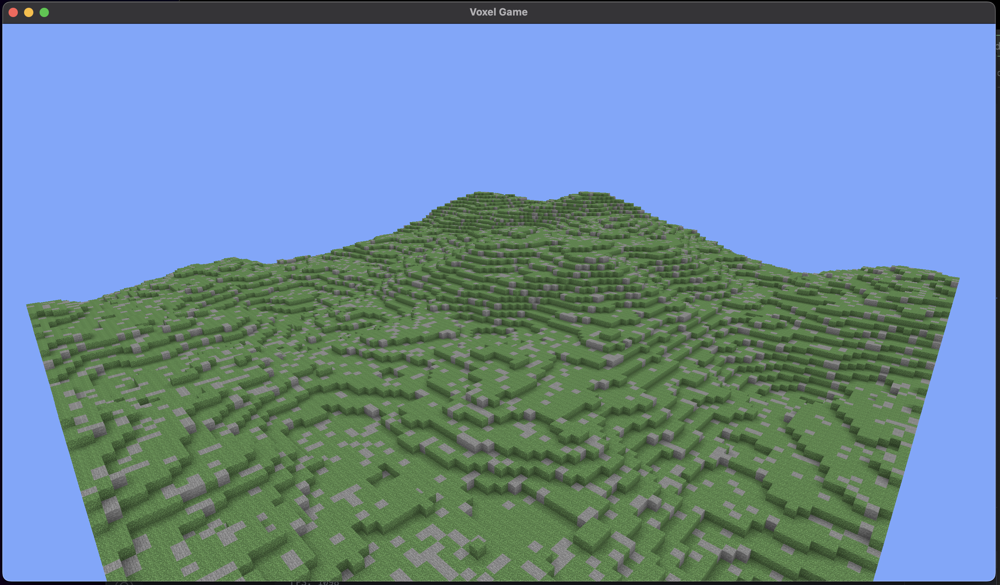
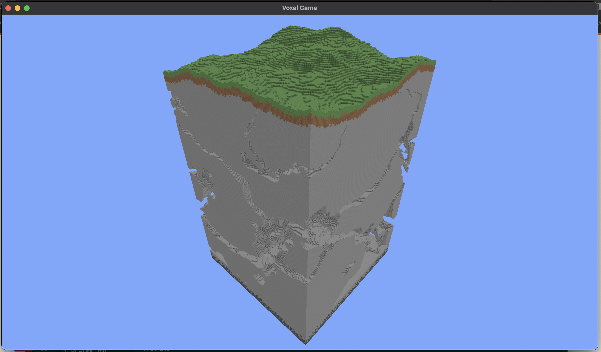

# Voxel Game Engine
A simple voxel game heavily inspired by Minecraft that I am working on
using C++ and OpenGL. 

## Controls
Use W, A, S, D to move, mouse to look around, SHIFT to fly down, SPACE to fly up.
Press Esc to unlock the mouse.

## Features
As the game is currently in its very early stages, there is not much yet.
Here are some features that I have implemented so far.
All the graphics currently in the game are temporary (which is why I borrowed
Minecraft's textures for now).
- Chunk-based procedurally generated worlds
- Different block types (currently only grass and stone)
- Separated update and rendering loop (logic runs at 60 tick per second whereas rendering is uncapped)
- Ambient Occlusion

## Features  Planned
Although I am unsure whether I will reach the stage of actually creating a full game, here are my
plans on this game.
- Greedy meshing (WIP)
- Placing and breaking blocks
- Randomly generated structures

